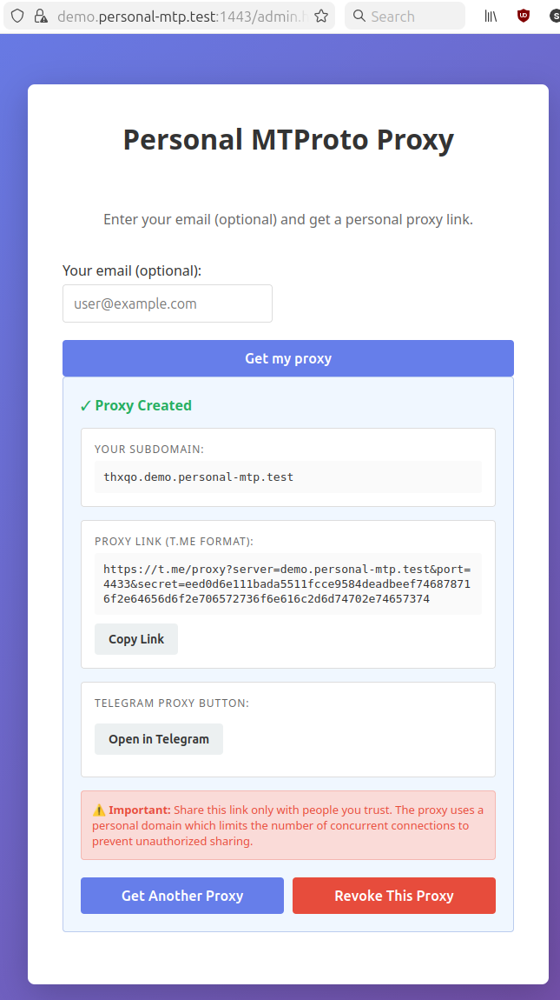

## Personal MTProto Proxy Demo

Demo app: [mtproto_proxy](https://github.com/seriyps/mtproto_proxy) + Cowboy + personal domain registration UI.

Users visit a web page, optionally enter their email, and receive a personal
MTProto proxy link on a unique subdomain (e.g. `aqfmc.demo.personal-mtp.online`).
Subdomains are persisted in DETS and restored into the policy table on restart.

[Article](priv/ARTICLE.md)



## Local development

It requires Erlang 25+ installed! On Ubuntu: `sudo apt install erlang-nox erlang-dev`.

```bash
# Start shell with self-signed certs + /etc/hosts entry auto-configured
make dev

# Cleanup: removes /etc/hosts entry, certs, and compiled beams
make clean
```

Then open https://demo.personal-mtp.test:2443/ in your browser
(accept the self-signed cert warning).

The MTP proxy itself listens on port 2443 in local mode (no root required).

## Production build & install

```bash
# Install Erlang
sudo apt install erlang-nox erlang-dev

# Copy and edit configs
cp config/sys.config.example config/sys.config
cp config/vm.args.example config/vm.args
$EDITOR config/sys.config   # set base_domain, cert paths, real secret

# Build release
make
```
> Generate TLS certificate BEFORE starting the service (see [TLS certificate](#tls-certificate-production) section below)!

```bash
# Install to /opt/personal_mtproxy + systemd unit
sudo make install
sudo systemctl enable --now personal_mtproxy
```

## TLS certificate (production)

Single-domain cert via certbot (HTTP-01 challenge, no DNS required):

```bash
certbot certonly --standalone -d demo.personal-mtp.online
```

Wildcard cert (`*.demo.personal-mtp.online`) requires DNS-01 — see [article](priv/ARTICLE.md) for details.

